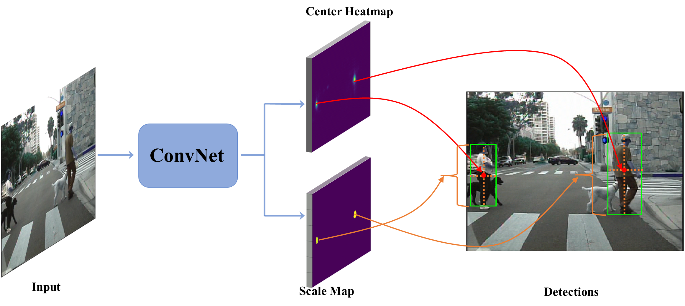
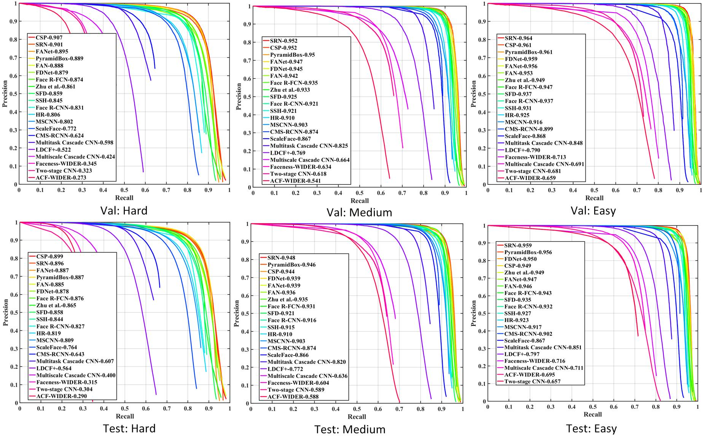

# High-level Semantic Feature Detection: A New Perspective for Pedestrian Detection

[](https://paperswithcode.com/sota/pedestrian-detection-caltech?p=high-level-semantic-feature-detectiona-new)
[](https://paperswithcode.com/sota/pedestrian-detection-citypersons?p=high-level-semantic-feature-detectiona-new)

Keras implementation of [CSP] accepted by CVPR 2019.

## Introduction
This paper provides a new perspective for detecting pedestrians where detection is formulated as Center and Scale Prediction (CSP), the pipeline is illustrated in the following. For more details, please refer to our [paper](./docs/2019CVPR-CSP.pdf).


Besides the superority on pedestrian detection demonstrated in the paper, we take a step further towards the generablity of CSP and validate it on face detection. Experimental reults on WiderFace benchmark also show the competitiveness of CSP.



### Dependencies

* Python 2.7
* Tensorflow 1.4.1
* Keras 2.0.6
* OpenCV 3.4.1.15

## Contents
1. [Installation](#installation)
2. [Preparation](#preparation)
3. [Training](#training)
4. [Test](#test)
5. [Evaluation](#evaluation)
6. [Models](#models)

### Installation
1. Get the code. We will call the cloned directory as '$CSP'.
```
  git clone https://github.com/liuwei16/CSP.git
```
2. Install the requirments.
```
  pip install -r requirements.txt
```

### Preparation
1. Download the dataset.

 For pedestrian detection, we train and test our model on [Caltech](http://www.vision.caltech.edu/Image_Datasets/CaltechPedestrians/) and [CityPersons](https://bitbucket.org/shanshanzhang/citypersons), you should firstly download the datasets. By default, we assume the dataset is stored in `./data/`.

2. Dataset preparation.

 For Caltech, you can follow [./eval_caltech/extract_img_anno.m](./eval_caltech/extract_img_anno.m) to extract official seq files into images. Training and test are based on the new annotations provided by [Shanshan2016CVPR](https://www.mpi-inf.mpg.de/departments/computer-vision-and-multimodal-computing/research/people-detection-pose-estimation-and-tracking/how-far-are-we-from-solving-pedestrian-detection/). We use the train_10x setting (42782 images) for training, the official test set has 4024 images. By default, we assume that images and annotations are stored in `./data/caltech`, and the directory structure is
 ```
*DATA_PATH
	*train_3
		*annotations_new
        	*set00_V000_I00002.txt
        	*...
		*images
            *set00_V000_I00002.jpg
        	*...
	*test
		*annotations_new
        	*set06_V000_I00029.jpg.txt
            *...
		*images
        	*set06_V000_I00029.jpg
            *...
```
For citypersons, we use the training set (2975 images) for training and test on the validation set (500 images), we assume that images and annotations are stored in  `./data/citypersons`, and the directory structure is
 ```
*DATA_PATH
	*annotations
		*anno_train.mat
		*anno_val.mat
	*images
		*train
		*val
```
We have provided the cache files of training and validation subsets. Optionally, you can also follow the [./generate_cache_caltech.py](./generate_cache_caltech.py) and [./generate_cache_city.py](./generate_cache_city.py) to create the cache files for training and validation. By default, we assume the cache files is stored in `./data/cache/`. For Caltech, we split the training set into images with and without any pedestrian instance, resulting in 9105 and 33767 images.

3. Download the initialized models.

 We use the backbone [ResNet-50](https://github.com/fchollet/deep-learning-models/releases/download/v0.2/resnet50_weights_tf_dim_ordering_tf_kernels.h5) and [MobileNet_v1](https://github.com/fchollet/deep-learning-models/releases/download/v0.6/) in our experiments. By default, we assume the weight files is stored in `./data/models/`.

### Training
Optionally, you should set the training parameters in [./keras_csp/config.py](./keras_csp/config.py)
1. Train on Caltech.

 Follow the [./train_caltech.py](./train_caltech.py) to start training. The weight files of all epochs will be saved in `./output/valmodels/caltech`.
 
2. Train on CityPersons.
 
 Follow the [./train_city.py](./train_city.py) to start training. The weight files of all epochs will be saved in `./output/valmodels/city`.

### Test
1. Caltech.

 Follow the [./test_caltech.py](./test_caltech.py) to get the detection results. You can test from epoch 51, and the results will be saved in `./output/valresults/caltech`. 
 
2. CityPersons.
 
 Follow the [./test_city.py](./test_city.py) to get the detection results. You can test from epoch 51, and the results will be saved in `./output/valresults/city`. 

### Evaluation
1. Caltech.

 Follow the [./eval_caltech/dbEval.m](./eval_caltech/dbEval.m) to get the Miss Rates of detections in `pth.resDir` defined in line 25. Finally, evaluation results will be saved as `eval-newReasonable.txt` in `./eval_caltech/ResultsEval`.
 
2. CityPersons.

 (1) Follow the [./eval_city/dt_txt2json.m](./eval_city/dt_txt2json.m) to convert the '.txt' files to '.json'. The specific `main_path` is defined in line 3.
 
 (2) Follow the [./eval_city/eval_script/eval_demo.py](./eval_city/eval_script/eval_demo.py) to get the Miss Rates of detections in `main_path` defined in line 9.

### Models
To reproduce the results in our paper, we have provided the models trained from different datasets. You can download them through [BaiduYun](https://pan.baidu.com/s/1SSPQnbDP6zf9xf8eCDi3Fw) (Code: jcgd). For Caltech, please make sure that the version of OpenCV is 3.4.1.15, other versions will read the same image into different data values, resulting in slightly different performance.
1. For Caltech
 
 ResNet-50 initialized from ImageNet:
 
 Height prediction: [model_CSP/caltech/fromimgnet/h/nooffset](https://pan.baidu.com/s/1SSPQnbDP6zf9xf8eCDi3Fw)
  
 Height+Offset prediciton: [model_CSP/caltech/fromimgnet/h/withoffset](https://pan.baidu.com/s/1SSPQnbDP6zf9xf8eCDi3Fw)
 
 Height+Width prediciton: [model_CSP/caltech/fromimgnet/h+w/](https://pan.baidu.com/s/1SSPQnbDP6zf9xf8eCDi3Fw)
 
 ResNet-50 initialized from CityPersons:
  
 Height+Offset prediciton: [model_CSP/caltech/fromcity/](https://pan.baidu.com/s/1SSPQnbDP6zf9xf8eCDi3Fw)
 
2. For CityPersons: 

 Height prediction: [model_CSP/cityperson/nooffset](https://pan.baidu.com/s/1SSPQnbDP6zf9xf8eCDi3Fw)
 
 Height+Offset prediction: [model_CSP/cityperson/withoffset](https://pan.baidu.com/s/1SSPQnbDP6zf9xf8eCDi3Fw)
 
 Upon this codebase, we also have 10 trails on Height+Offset prediction. Generally, models will be converged after epoch 50. For Caltech and CityPersons, we test the results from epoch 50 to 120 and from epoch 50 to 150, respectively, and get the best result (*MR* under Reasonable setting) given in the following table.
 
 | Trial | 1 | 2 | 3 | 4 | 5 | 6 | 7 | 8 | 9 | 10 |
 |:-----:|:-:|:-:|:-:|:-:|:-:|:-:|:-:|:-:|:-:|:--:|
 |Caltech| 4.98 | 4.75 | 4.57 | 4.84 | 4.72 | 4.15 | 5.17 | 4.60 | 4.63 | 4.91 |
 |CityPersons| 11.31 | 11.17 | 11.42 | 11.69 | 11.56 | 11.05 | 11.59 | 11.78 | 11.27 | 10.62 |
 
 
### Extension--Face Detection
1. Data preparation 

 You should firstly download the [WiderFace](http://mmlab.ie.cuhk.edu.hk/projects/WIDERFace/) dataset and put it in `./data/WiderFace`. We have provided the cache files in `./data/cache/widerface` or you can follow [./genetrate_cache_wider.py](./genetrate_cache_wider.py) to cerate them.
 
2. Training and Test

 For face detection, CSP is required to predict both height and width of each instance with various aspect ratios. You can follow the [./train_wider.py](./train_wider.py) to start training and [./test_wider_ms.py](./test_wider_ms.py) for multi-scale test. As a common practice, the model trained on the official training set is evaluated on both validation and test set, and the results are submitted to [WiderFace](http://mmlab.ie.cuhk.edu.hk/projects/WIDERFace/). To reprodect the result in the benchmark, we provide the model for Height+Width+Offset prediction in [model_CSP/widerface/](https://pan.baidu.com/s/1SSPQnbDP6zf9xf8eCDi3Fw).
 
 Note that we adopt the similar data-augmentation strategy for training and multi-scale testing in [PyramidBox](https://arxiv.org/pdf/1803.07737.pdf), which helps us to achieve better performance in this benchmark. 

## Citation
If you think our work is useful in your research, please consider citing:
```
@inproceedings{liu2018high,
  title={High-level Semantic Feature Detection: A New Perspective for Pedestrian Detection},
  author={Wei Liu, Shengcai Liao, Weiqiang Ren, Weidong Hu, Yinan Yu},
  booktitle={IEEE Conference on Computer Vision and Pattern Recognition (CVPR)},
  year={2019}
}
```


